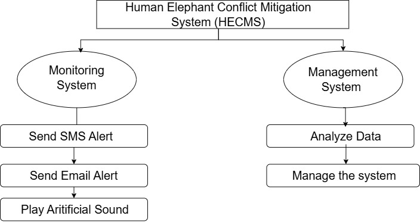
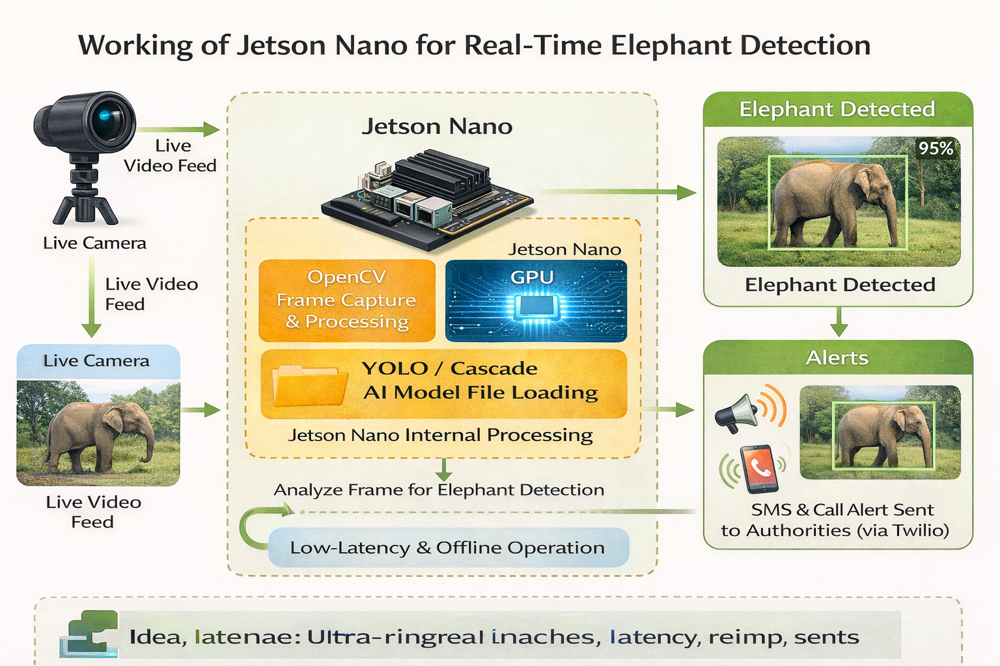
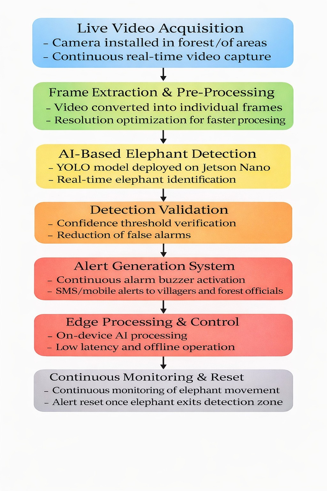
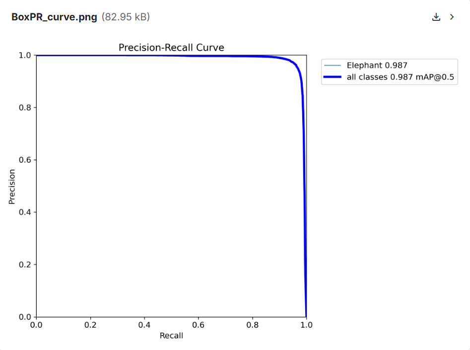
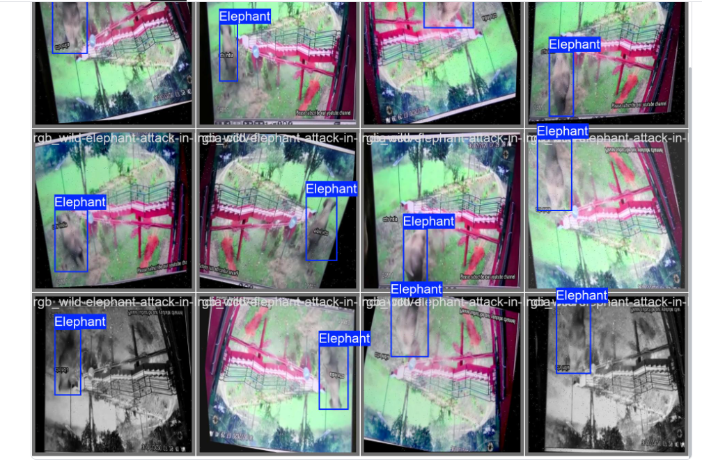
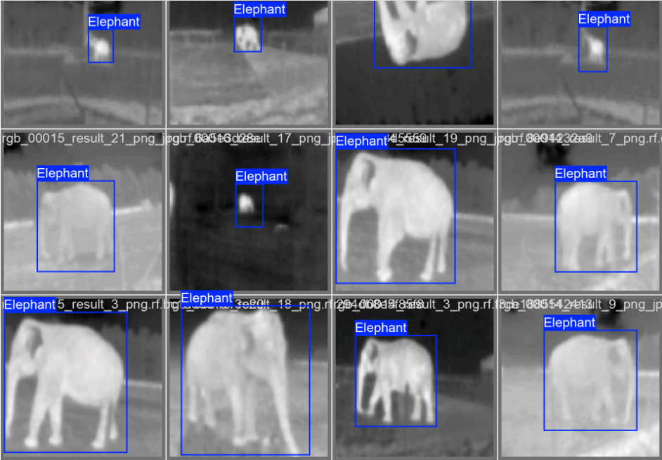
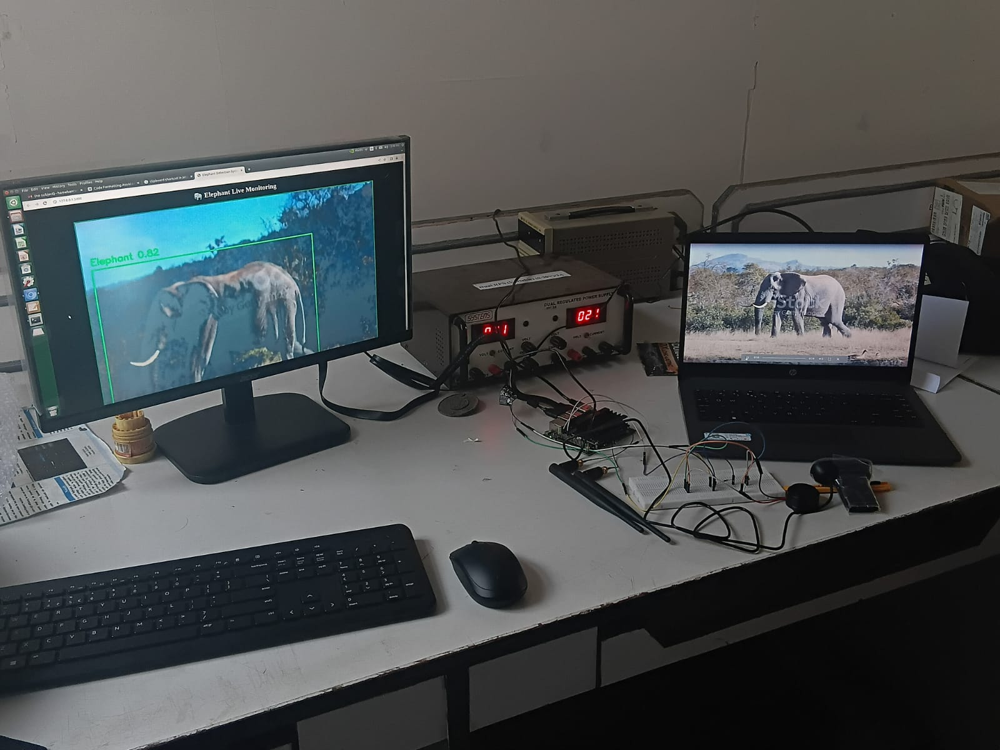

# 🐘 Human-Elephant Conflict Mitigation using Edge AI

**Design and Implementation of an AI-Based Technique for Human-Elephant Conflict Mitigation**

An edge-AI powered early-warning system that detects elephants in real time using **YOLOv8** and triggers instant alerts (buzzer, SMS/voice call, and mobile notifications) — helping forest-border communities and elephants coexist safely.

📄 Published conference paper (IEEE) · 🎓 UEE2818 Major Project, Dept. of EEE, SSN College of Engineering

---

## 📖 Overview

Human-Elephant Conflict (HEC) is a growing crisis across Asia and Africa as human settlements and agriculture expand into elephant habitats, resulting in crop damage, property loss, and casualties on both sides. Traditional mitigation methods — manual patrolling, fencing, and conventional alarms — are reactive, labour-intensive, and often too slow to prevent an incident.

This project builds a **low-cost, solar-capable, edge-computing early-warning system** that:

- Continuously monitors forest-border zones using a camera + PIR motion sensor
- Runs a **YOLOv8** object-detection model **locally on the edge device** (no cloud dependency)
- Confirms elephant presence with high confidence and low false-alarm rate
- Instantly triggers an **on-site buzzer/alarm** and sends **SMS, voice call, and mobile alerts** to villagers and forest officials

By moving AI inference to the edge instead of the cloud, the system stays functional even with poor or no internet connectivity in remote forest regions, while keeping latency and power consumption low.

---

## 🎯 Objectives

- Develop an AI-based real-time system that accurately detects elephants using deep learning
- Reduce human-elephant conflict through early-warning alerts before elephants reach populated areas
- Implement an integrated alert mechanism (buzzer + mobile notifications) for immediate response
- Deploy the detection model on an edge-computing platform for low-latency, offline-capable operation
- Ensure reliable performance across varying lighting and environmental conditions (including night)
- Design a scalable, cost-effective solution suitable for large-scale deployment along forest borders

---

## 🏗️ System Architecture



The **Human Elephant Conflict Mitigation System (HECMS)** is organized into two cooperating subsystems:

- **Monitoring System** — sends SMS alerts, sends email alerts, and plays an on-site audible alarm
- **Management System** — analyzes incoming detection data and manages overall system behaviour

### End-to-end detection pipeline



1. **Sensing** — A PIR sensor continuously monitors for thermal/motion activity at near-zero power
2. **Trigger** — Motion detected → camera module wakes and captures a live frame/image
3. **Edge Inference** — The frame is passed to a YOLOv8 model running on-device (Jetson Nano)
4. **Filtering** — Detections are filtered to the "elephant" class and passed through a confidence threshold to reject false positives (occlusion, foliage, low light, etc.)
5. **Alerting** — On a validated detection, the system triggers the local buzzer and sends SMS/voice-call/mobile-app alerts to nearby communities and forest officials
6. **Low-latency, offline-first** — Because inference happens on-device, the alert is generated in milliseconds without requiring an active internet connection

### Methodology / workflow



`Live Video Acquisition → Frame Extraction & Pre-processing → AI-Based Elephant Detection → Detection Validation → Alert Generation System → Edge Processing & Control → Continuous Monitoring & Reset`

---

## 🧠 Why YOLOv8?

YOLO (**Y**ou **O**nly **L**ook **O**nce) performs classification and localization in a single forward pass over the image, rather than scanning it multiple times, which makes it fast enough for real-time video streams.

| Reason | Benefit |
|---|---|
| Real-time detection | Processes video frame-by-frame at high FPS |
| Robust in complex scenes | Handles variation in elephant size, pose, lighting, and background clutter (trees, shadows, vehicles) |
| Runs on edge hardware | Lightweight variants (YOLOv8n) run on Jetson Nano / Raspberry Pi-class devices without a server |
| Single-pass detection | Lower latency than proposal + classification pipelines |
| Scalable | Multiple low-cost units can be deployed across different forest-entry points |
| Alert-ready output | Bounding boxes + confidence scores map directly onto the SMS/email/buzzer alert pipeline |

A pre-trained YOLOv8 model (COCO weights, "elephant" class) was fine-tuned and optimized for wild-forest conditions — as opposed to most existing research, which is trained on "captive/zoo" datasets where elephants stand out against clear backgrounds. This project specifically targeted the harder **"camouflage" problem**, where elephants blend into dense forest and scrubland.

**Model selection benchmarking** (on NVIDIA Jetson Nano 4GB, evaluated on a "Wild Elephant" dataset):

| Model | mAP | FPS | Verdict |
|---|---|---|---|
| **YOLOv8 Nano (selected)** | **98.4%** | **32** | ✅ Real-time & accurate |
| YOLOv8 Small | 98.6% | 14 | ❌ Too slow for rapid alerting |
| SSD MobileNet V2 | 91.2% | 45 | ❌ Fast, but unacceptable false negatives |

Accuracy was further improved using **mosaic augmentation**, **random rotation (±10°)**, **transfer learning** with a frozen backbone, and **IoU threshold tuning (0.7)** to suppress loose/false bounding boxes.

---

## 📊 Model Performance



| Metric | Value |
|---|---|
| Dataset size | 40,000+ images (train/val split 80/20) |
| mAP@50 | **98.2%** (target was 98%) |
| Recall (sensitivity) | **97.5%** |
| Inference latency (Jetson Nano, TensorRT FP16) | **~35 ms/frame** (>30 FPS) |
| False positive rate | **< 2%** (confidence threshold tuned to 0.60–0.80) |
| Model size | **< 10 MB** after TensorRT FP16 quantization |
| Occlusion handling | Successfully detects elephants with up to ~40% of the body hidden behind trees/foliage |

### Sample detections

<p float="left">
  
  
</p>

---

## 🔩 Hardware



| Component | Purpose |
|---|---|
| **NVIDIA Jetson Nano** | Core edge-AI processing unit — GPU-accelerated inference for real-time YOLOv8 execution |
| **Camera module** | Captures live video/still frames for detection (day and low-visibility/night conditions) |
| **PIR sensor** | Low-power motion trigger to wake the system from sleep |
| **Buzzer / alarm unit** | Immediate on-site audible alert on confirmed detection |
| **4G/LTE or LoRaWAN module** | Sends compact alert packets to the server/community without streaming video |
| **Solar panel + battery + charge controller** | Enables autonomous, sustainable operation in remote areas with no mains power |

**Approximate cost (prototype):**

| Equipment | Price (₹) |
|---|---|
| Jetson Nano | 37,000 |
| Camera | 700 |

The design deliberately favours a low-power **sleep–wake cycle**: the PIR sensor idles in microamp-level standby, while the processor, camera, and radio only power up once motion is confirmed — keeping the whole unit solar-sustainable.

---

## 📡 Alerting & Communication

- On a validated detection, a small **JSON alert packet** (sensor ID, GPS coordinates, timestamp, confidence score) is sent over **4G/LTE** (where cellular coverage exists) or **LoRaWAN** (for low-connectivity forest zones)
- The server logs the event, maps the sensor to its geographic zone/user group, and fans the alert out via **SMS, voice call, mobile push notification, and dashboard**, giving redundancy if one channel fails
- On-site, a **buzzer/alarm** provides an immediate audible warning regardless of network availability

---

## ✅ Results Summary

- Achieved **~98% detection accuracy** on the wild elephant test set after fine-tuning and optimization
- Real-time inference on Jetson Nano at **~35 ms/frame (>30 FPS)**
- **False positives reduced to <2%** via confidence threshold and IoU tuning
- **97.5% recall**, including under partial occlusion and cluttered forest backgrounds
- Full pipeline (**Detection → Confirmation → Buzzer Activation → Notification**) validated end-to-end, including low-light/night scenarios

---

## 🌍 Alignment with UN Sustainable Development Goals

| SDG | Contribution |
|---|---|
| **SDG 9** — Industry, Innovation & Infrastructure | Applies AI, sensors, and data-driven solutions to a real ecological problem |
| **SDG 11** — Sustainable Cities & Communities | Provides a safer living environment near forests; strengthens community preparedness through early warning |
| **SDG 15** — Life on Land | Supports conservation of the endangered Asian elephant and its habitat by reducing negative human-elephant interactions |

---

## 📚 Publication

> **Design and Implementation of an AI Based Technique for Human Elephant Conflict Mitigation**
> R. Jayaparvathy, Rajasi Mandal, G.G. Jegadheeshwaran, Hamebantei K. Tangsang, Arnab Sheoran
> Department of Electrical and Electronics Engineering, Sri Sivasubramaniya Nadar College of Engineering, Chennai, India

**Keywords:** Human–Elephant Conflict (HEC), Edge Computing, YOLOv8, Object Detection, Passive Infrared (PIR) Sensor, Solar-Powered System, IoT-Based Monitoring, Real-Time Alert System, 4G/LTE Communication, LoRaWAN, Embedded Systems, Wildlife Intrusion Detection.

See [`conferencepaper_EEE.docx`](./conferencepaper_EEE.docx) for the full paper.

---

## 👥 Team

| Member | Role / Contribution |
|---|---|
| **G.G. Jegadheeshwaran** | Dataset specialist — collected & labelled elephant/stock video frames across poses, lighting, and environments |
| **Hamebantei K. Tangsang** | Led the shift from image-based to video-based real-time detection |
| **Arnab Sheoran** | Implemented and fine-tuned the YOLO/MobileNet deep learning model for real-time inference |

**Project Guide (Internal):** Dr. Rajasi Mandal, Asst. Professor, EEE, SSNCE
**Co-Supervisor (Internal):** Dr. R. Jayaparvathy, Professor, EEE, SSNCE

*UEE2818 – Major Project, Department of Electrical and Electronics Engineering, SSN College of Engineering, Chennai*

---

## 🚀 Impact & Future Scope

- Deployable, industry-ready IoT early-warning solution for forest departments and public-private partnerships
- Scalable and replicable model for other human-wildlife conflict zones across India and globally
- Potential for patenting the detection mechanism, alert-communication framework, and combined hardware–software system
- Roadmap includes a monitoring UI/dashboard, expanded multi-sensor fusion, and wider field trials across additional forest-border sites

---

## 📁 Repository Structure

```
.
├── README.md
├── conferencepaper_EEE.docx     # Published IEEE conference paper
├── PROJECT_PPT_R3.pptx          # Final project review presentation
├── A2.pptx                      # Earlier project review presentation
└── assets/                      # Diagrams and result images used in this README
```

---

## 📄 License

Add your preferred license here (e.g., MIT) — this project was developed as part of an academic major project at SSN College of Engineering.
